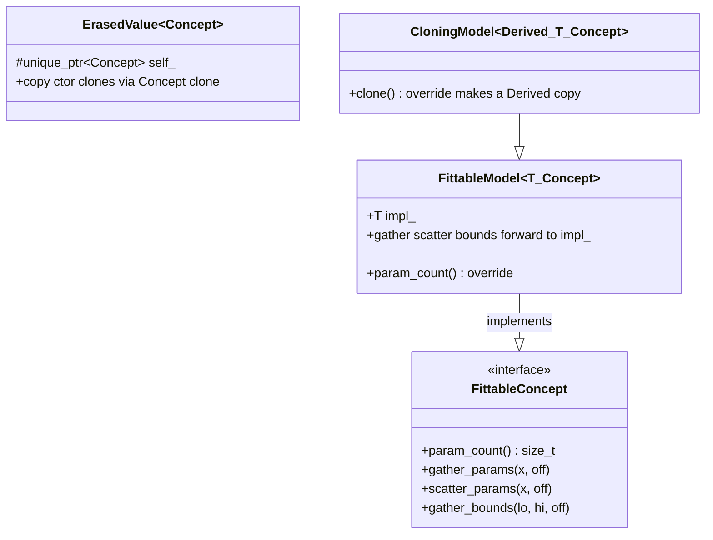
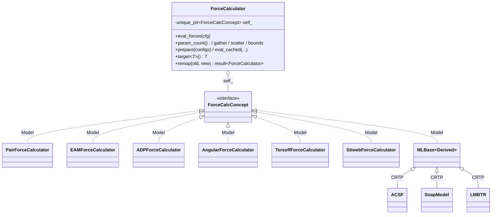
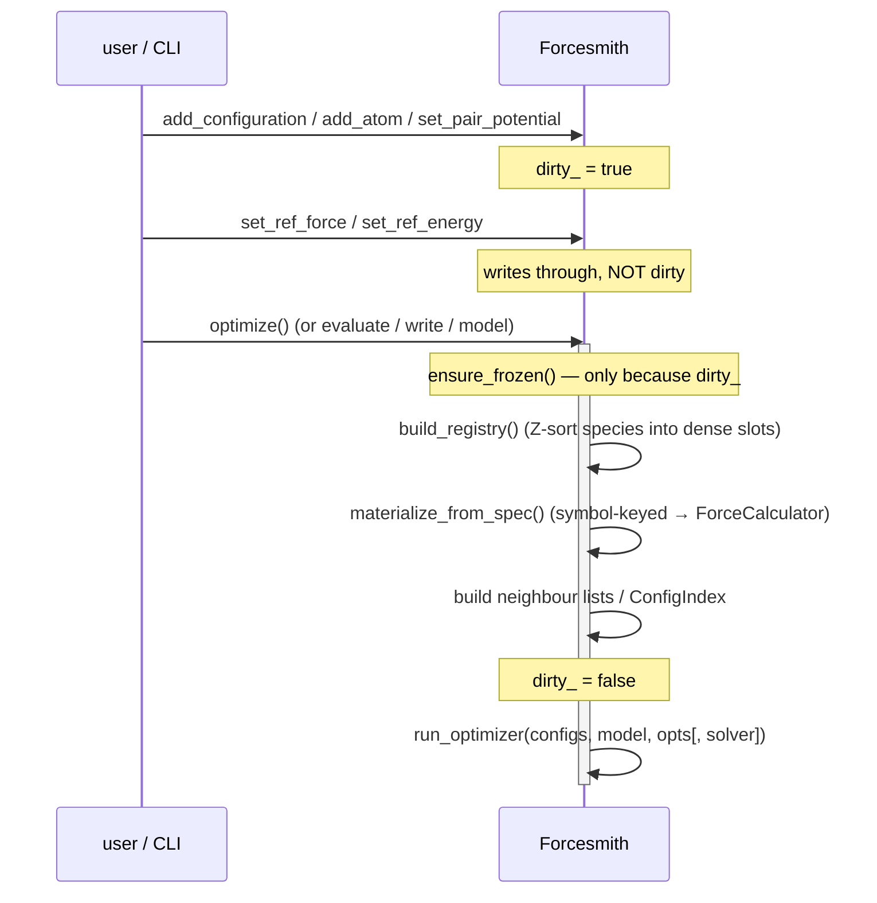

# Forcesmith — Design

This document explains *how* Forcesmith is put together: the artifact layering,
the polymorphism style, the type-erasure machinery, the CRTP bases, the
customisation points, and how the optimiser is wired to a force model. It is the
"why it looks like this" companion to the user-facing [`README.md`](../README.md)
and the how-to-plug-in guide [`docs/extension.md`](extension.md).

The guiding principle is one rule, applied everywhere:

> **No open virtual hierarchies, no `enum` + `switch` dispatch.** Every
> polymorphic surface a user might extend is a **value-semantic type-erased
> wrapper**; every family of closely related concrete types shares a **CRTP
> base**; every cross-cutting, defaulted behaviour is a **free-function
> customisation point (CPO)**. Errors flow through `boost::leaf::result<T>`, not
> exceptions.

---

## 1. Artifact layering

Forcesmith builds as three artifacts. The CLI is just another client of the
public API — there is no privileged construction path that bypasses it.

```
┌─────────────────────────────────────────────────────────────┐
│  forcesmith   (CLI binary)        src/cli/*.cpp               │
│  parse args → drive the facade → write results                │
└───────────────────────────┬─────────────────────────────────┘
                            │  is a plain client of
┌───────────────────────────▼─────────────────────────────────┐
│  libforcesmith.so   (public API)  forcesmith::Forcesmith      │
│  the owning facade: build a fit in memory, evaluate, optimize │
└───────────────────────────┬─────────────────────────────────┘
                            │  built on
┌───────────────────────────▼─────────────────────────────────┐
│  forcesmith_engine  (static)                                  │
│  force models · neighbour lists · optimisers · I/O · descriptors│
└───────────────────────────────────────────────────────────────┘
```

`io::load_configs` and `io::load_model` are themselves clients of the facade:
they parse files and call the same `add_configuration` / `seed_force_model`
methods a programmatic user would.

---

## 2. The polymorphism toolkit

Three distinct mechanisms, each for a different job:

| Mechanism | Used for | Examples |
|-----------|----------|----------|
| **Value-semantic type erasure** | open extension points — a *value* the engine stores and calls without knowing the concrete type | `RadialPotential`, `ForceCalculator`, `Solver`, `EnergyHead` |
| **CRTP base** | families of closely related concrete types sharing boilerplate | `AnalyticBase<D,N>`, `ParamSet<D>`, `MLBase<D>`, `HeadParams<D>`, `ForceCalculatorBase<D>` |
| **Free-function CPO** | cross-cutting behaviour with a correct default that only some types override | `curvature_count` / `write_curvature`, `model_smoothness_count` / `model_write_smoothness` |

The remainder of this document is organised around these three.

---

## 3. Value-semantic type erasure

### 3.1 The mechanism

All erased wrappers share two tiny storage bases in
`include/forcesmith/core/erased.hpp`:

- **`ErasedValue<Concept>`** — copyable. Copy clones through the concept's
  virtual `clone()`. Used where the value must be duplicable (a potential gets
  copied into a table; a model is cloned for a checkpoint).
- **`ErasedMoveOnly<Concept>`** — move-only, no `clone()`. Used for `Solver`,
  which is never copied.

Both just own a `std::unique_ptr<Concept> self_`. The concept is a pure-virtual
interface; a templated `Model<T>` adapter forwards each virtual to the concrete
`impl_`. The common param-plumbing virtuals and the `clone()` boilerplate are
themselves factored into reusable model bases in
`include/forcesmith/core/fit_params.hpp`:



A concrete erased type (say `RadialPotential`) then:

1. derives its concept from `FittableConcept` (so it inherits the four
   optimiser-plumbing virtuals for free) and adds its own pure virtuals;
2. defines its inner `Model<T>` by deriving from `CloningModel<Model<T>, T,
   Concept>` (so `clone()` and the param plumbing are supplied) and only writes
   the domain virtuals;
3. derives privately from `ErasedValue<Concept>` and exposes a thin value
   interface that forwards to `self_->…`.

### 3.2 The four erased surfaces

| Wrapper | Storage | Concept (interface) | Defined in | Escape hatch |
|---------|---------|---------------------|------------|--------------|
| `RadialPotential` | `ErasedValue` | `RadialPotentialConcept : FittableConcept` | `core/radial_potential.hpp` | `target<T>()` |
| `ForceCalculator` | `ErasedValue` | `ForceCalcConcept : FittableConcept` | `force/force_calculator.hpp` (concept in `core/force_calc_base.hpp`) | `target<T>()` |
| `EnergyHead` | `ErasedValue` | `HeadConcept` | `force/ml_energy_heads.hpp` | — |
| `Solver` | `ErasedMoveOnly` | `SolverConcept` | `optimization/solver.hpp` | — |

Each replaces what would otherwise be a closed `std::variant` (or a virtual
hierarchy the user must inherit from). A new concrete type satisfies a
compile-time **concept** and drops in — no edit to the wrapper header, no engine
recompile.

### 3.3 Optional methods — `if constexpr (requires …)` in `Model<T>`

The concept is the *complete* interface so the wrapper can call any method
unconditionally. But not every concrete type implements every method. The
`Model<T>` adapter bridges the gap: each *optional* virtual probes the impl with
`if constexpr (requires …)` and supplies a default when absent. From
`RadialPotential::Model<T>`:

```cpp
int prepare_site(double r) const override {
  if constexpr (requires(const T& t, double rr) { t.prepare_site(rr); })
    return impl_.prepare_site(r);          // spline: real cached-site index
  else
    return -1;                             // analytic: "no cache"
}
std::pair<double,double> eval_and_deriv(double r) const override {
  if constexpr (requires(const T& t, double rr) { t.eval_and_deriv(rr); })
    return impl_.eval_and_deriv(r);        // fused if the type offers it
  else
    return {impl_.eval(r), impl_.deriv(r)};// else compose the two
}
```

So an analytic potential need only write `eval`/`deriv`/`span` and the param
plumbing; the spline path, the fused value+derivative path, and the
`set_param`/`set_fixed`/`set_bounds` no-ops are all synthesised. The same idiom
defaults the descriptor-cache fast paths on `ForceCalculator::Model<T>` and
`honors_bounds()` on `Solver::Model<T>`.

### 3.4 The escape hatch — `target<T>()`

A few call sites legitimately need the concrete type back: native file writers
(`src/io/write_model.cpp`), pair-table edits, and spec decomposition. Both
`RadialPotential` and `ForceCalculator` expose

```cpp
template <class T> const T* target() const noexcept;   // mirrors std::function::target
```

It is a self-checking `dynamic_cast` on the inner `Model<T>` — a mismatch yields
`nullptr` (caller falls back to the virtual path). Because the RTTI cost is real,
the convention is to hoist it out of hot loops (resolve once per table, not per
bond). This is also the engine's *devirtualisation* lever: the EAM hot path
recovers the concrete spline via `target<SplinePotential>()` once, then calls
its force-inlined accessors directly.

### 3.5 RadialPotential — the spline site cache

`RadialPotential` carries an extra, typed fast-path API for tabulated potentials.
`prepare_site(r)` hands back an opaque `SiteId` (`core/site_id.hpp`):
`cacheable()` for a spline (it stashed the interval/index), "none" for an
analytic one. The `eval_at(site)` / `deriv_at(site)` / `eval_and_deriv_at(site)`
family then evaluate without re-running the interval search. The free helpers
`eval_cached` / `deriv_cached` / `eval_deriv_cached` (and the range-gated
`eval_gated` family in `force_calculator_concept.hpp`) pick the cached or direct
path per bond.

Threading contract: `prepare_site` mutates an internal site table and must be
called single-threaded (the calculator's `prepare()` phase); the `*_at` readers
are const and safe inside the parallel Jacobian.

---

## 4. The ForceCalculator surface in detail

A **force calculator** is the top-level model the optimiser fits: it owns the
potentials/heads, builds neighbour lists, and turns a `Configuration` into
forces/energy/stress.

### 4.1 The concept

`ForceCalculatorModel` (`force/force_calculator_concept.hpp`) is the minimal
required surface:

```cpp
template <typename T>
concept ForceCalculatorModel = requires(T c, Configuration& cfg,
                                        Eigen::VectorXd& v, std::size_t off) {
  { c.eval_forces(cfg) }       -> std::same_as<void>;
  { c.param_count() }          -> std::same_as<std::size_t>;
  { c.gather_params(v, off) }  -> std::same_as<void>;
  { c.scatter_params(v, off) } -> std::same_as<void>;
  { c.gather_bounds(v,v,off) } -> std::same_as<void>;
  { c.max_cutoff() }           -> std::same_as<double>;
};
```

plus a public `ntypes` member (supplied by inheriting
`ForceCalculatorBase<Derived>`). Everything else on the erased concept
(`ForceCalcConcept`, in `core/force_calc_base.hpp`) is *optional* and defaulted
in `Model<T>` as in §3.3.

### 4.2 Capability mixins — opt-in behaviour without `if constexpr` sprawl

Two cross-cutting capabilities are expressed as **mixin structs** the concrete
calculator inherits, so the rest of the contract is satisfied with the right
default behaviour automatically:

- **Global parameters** — `NoGlobals` (the common case: an empty no-op set) vs
  `WithGlobals` (carries a `std::vector<GlobalParam>`). A `GlobalParam` is one
  optimiser slot broadcast into several potential slots before each force eval;
  the linked slots are held *fixed* so only the global's own value enters the
  parameter vector.
- **Descriptor-cache fit fast-path** — `FitCache<Derived, HasCache=false>`. The
  default (`HasCache=false`) gives every analytic calculator the correct
  *no-cache* answers: `has_cache()==false`, the indexed `eval_forces(cfg,
  cache_index)` just recomputes via the plain `eval_forces(cfg)`, and the cached
  residual/Jacobian hooks are `std::unreachable()`. Only ML models
  (`MLBase`) set `HasCache=true` and implement the real descriptor cache.

```cpp
struct MyForce : ForceCalculatorBase<MyForce>, NoGlobals, FitCache<MyForce> {
  void eval_forces(Configuration& cfg) const;
  using FitCache<MyForce>::eval_forces;   // expose the indexed (no-cache) overload
  /* … rest of the concept … */
};
static_assert(forcesmith::ForceCalculatorModel<MyForce>);
```

### 4.3 `remap` — the one method that stays `requires`-probed

ML species re-ranking (`remap`) couples to `SpeciesRegistry` and returns a
`leaf::result`. It is genuinely ML-only, so rather than force every analytic
calculator to carry it, the wrapper's `Model<T>::remap` is `requires`-probed and
returns a leaf error for non-ML models. This is the deliberate exception to "the
concept is complete" — it keeps `SpeciesRegistry`/leaf out of the analytic
calculators' interface.



---

## 5. CRTP families

CRTP is reserved for *families of concrete types that share boilerplate*, never
for runtime dispatch.

### 5.1 `ParamSet<Derived>` and the fit-param plumbing

The single most-repeated chore in the codebase is "I own a set of `Param`;
expose the FREE (non-`fixed`) ones to the optimiser vector in a stable order, and
read them back." `core/fit_params.hpp` writes this *once* against the `ParamRange`
concept (a range of `Param` lvalues) and hands it out two ways:

- **`ParamSet<Derived>`** — a CRTP base. The derived type supplies one method,
  `param_fields()` (a range over its `Param`s); `ParamSet` synthesises
  `param_count` / `gather_params` / `scatter_params` / `gather_bounds`.
- **`gather_range` / `scatter_range` / `gather_bounds_range`** — free functions
  for *composite* calculators that delegate to a range of sub-potentials (EAM =
  pair ⊕ density ⊕ embedding tables). Each composite walks its tables and
  accumulates the running offset.

`Param` itself is `{value, fixed, min, max}`. "Fixed" is what makes a parameter
*not* appear in the optimiser vector; bounds become the `lower`/`upper` box the
bound-aware solvers honour.

### 5.2 `AnalyticBase<Derived, N>`

The base for the ~30 analytic radial functions. It owns the `N`-element `Param`
array and the cutoff, satisfies the full param contract via `ParamSet`, and
supplies `set_param`/`set_fixed`/`set_bounds`. A concrete function writes only
`eval_impl(double)` and `deriv_impl(double)`:

```cpp
struct Morse : AnalyticBase<Morse, 3> { /* eval_impl, deriv_impl */ };
```

`SmoothCutoff<Base>` is a decorator in the same family — it wraps any analytic
base and appends a switching width `h`, so a smooth-cutoff variant is one extra
type, not a rewrite.

### 5.3 `MLBase<Derived>` and `HeadParams<Derived>`

The ML family layers two CRTP bases:

- **`MLBase<Derived>`** is a `ForceCalculator`-shaped base whose `eval_forces` is
  *descriptor-agnostic*: it calls the derived model's `get_descriptor(atom)`
  hook, feeds the descriptor vector D to the head, and assembles
  energy/forces/stress. `Derived` (ACSF / SoapModel / LMBTR) supplies the
  descriptor and its gradient. `MLBase` implements the real `FitCache` and the
  `remap` re-ranking.
- **`HeadParams<Derived>`** is the head-side analogue of `ParamSet`: the concrete
  head exposes `field_ptrs()` (its fittable `Param*` slots) and `HeadParams`
  synthesises param counting / gather / scatter / bounds and (de)serialisation.

The head is itself value-erased (`EnergyHead`), so swapping the descriptor→energy
map (e.g. a non-linear head) never multiplies the calculator surface. The shipped
head is `LinearHead` (E = c·D + bias), which also advertises an exact analytic
parameter-Jacobian (`has_param_jacobian()`).

---

## 6. Customisation points (CPOs)

A CPO here is a pair of **free function templates** with a correct *default*,
overloaded (by ordinary overload resolution / ADL) for the specific types that
need real behaviour. This is how a cross-cutting concern gets a uniform call site
without putting an optional method on every concept.

### 6.1 Curvature / smoothness regularisation

A tabulated potential fit from forces and energies alone is rank-deficient
wherever no training configuration probes that part of its domain; the optimiser
is free to dump spikes into that null space. A small Tikhonov penalty on the
second difference (curvature) of the free knots removes the ambiguity — this is
the `--smooth-weight` term.

The CPO exists at two levels:

- **Potential level** (`potentials/curvature.hpp`): `curvature_count(p)` and
  `write_curvature(p, dst, off, weight)`. The templated default returns 0 / does
  nothing — correct for analytic potentials. `SplinePotential` overloads them.
- **Calculator level** (`force/smoothness.hpp`): `model_smoothness_count(m)` and
  `model_write_smoothness(m, …)`. The default returns 0 (Tersoff/Stiweb are
  purely analytic). The table-owning calculators (Pair/EAM/ADP/Angular) overload
  them to sum their tabulated tables' curvature residuals.

`RadialPotential::Model<T>` and `ForceCalculator::Model<T>` forward their
`smoothness_count`/`write_smoothness` virtuals into these CPOs, so the erased
value picks up whichever overload the concrete type resolved — without an
`if constexpr` and without a method on the base.

### 6.2 Potential decorators (`core/scale_potentials.hpp`)

The EAM gauge rescaling (`src/core/rescale.cpp`) needs to transform potentials
without disturbing the optimiser's view of their parameters. The decorators —
`LinearAdjustedPotential`, `ScaledOutputPotential`, `ScaledArgPotential`,
`CompensatedPairPotential` — each wrap a `RadialPotential`, transform
`eval`/`deriv`/`span`, and **delegate** `gather_params`/`scatter_params`/
`gather_bounds` straight to the base so the parameter layout is unchanged. They
are plain structs that satisfy the potential contract, so any of them can be
re-wrapped into a `RadialPotential` and dropped back into a table.

---

## 7. The optimiser pipeline

The objective is solver-agnostic: every solver minimises the same weighted
residual vector F(x), and ½‖F‖² is the cost. Per-solver tuning (iteration caps,
tolerances, seeds, DE parameters) lives *inside* the concrete `Solver`, not in
the shared options.

```mermaid
sequenceDiagram
    participant U as Forcesmith / run_optimizer
    participant Fn as ForcesmithFunctor
    participant M as ForceCalculator
    participant S as Solver (erased)

    U->>M: gather_params(x0)          %% seed the parameter vector
    U->>M: gather_bounds(lo, hi)
    U->>Fn: build residual + jacobian closures
    U->>S: minimize(x, F, J, n_vals, lo, hi)
    loop solver iterations
      S->>Fn: F(x)                    %% residuals
      Fn->>M: scatter_params(x); eval_forces / eval_cached (TBB over configs)
      M-->>Fn: forces / energy / stress
      Fn-->>S: weighted residual vector
      opt analytic / parallel Jacobian available
        S->>Fn: J(x, ∂F/∂x)
        Fn->>M: eval_cached_jacobian (parallel)
      end
    end
    S-->>U: status; x holds the optimum
    U->>M: scatter_params(x)          %% write the fitted params back
```

Key points:

- `ResidualFn` / `JacobianFn` are `std::function` typedefs. **An empty
  `JacobianFn` is meaningful**: it signals "no analytic/parallel Jacobian
  supplied", and a solver that needs one falls back to its own finite
  differences (`if (jac) … else …`).
- The five built-in solvers — `EigenLMSolver`, `EigenHybridSolver` (Powell
  dogleg), `BoostDESolver` (differential evolution), `LineSearchSolver` (Powell
  direction-set), and `IpoptSolver` (L-BFGS) — each satisfy the `CSolver`
  concept and carry a `static_assert(CSolver<…>)` so a contract break is a
  compile error.
- Box constraints flow as full-length `lower`/`upper` vectors aligned with the
  free-parameter vector (±∞ where unbounded). Only `honors_bounds()` solvers
  (Ipopt, DE) apply them; the gradient solvers ignore the two extra arguments.
- `make_default_solver()` is the fallback when no solver is injected.
- Parallelism is per-configuration via oneTBB inside the functor; DE keeps its
  population evaluation serial because the parallelism already lives one level
  down.

---

## 8. The facade lifecycle — lazy freeze

`forcesmith::Forcesmith` is an owning *edit buffer* with a lazy, internal build
step ("freeze"). Two classes of mutation behave differently:

- **Structural** edits (add/remove atoms, configs, elements, potentials) set
  `dirty_ = true`.
- **Reference-value** writes (forces/energy/stress/weight) and per-parameter
  edits write straight through to live data and do **not** dirty.

The expensive, invariant-establishing build runs lazily on the first
run/IO/lookup that needs it — the user never calls it:



**Auto-grow species.** Atoms and potentials are held by element *identity*
(symbol). The compact dense-table slot (`Species::index`, a Z-sorted rank) is
assigned only at freeze, so adding an atom of a brand-new element simply re-ranks
everything at the next freeze. A model *seeded* from a file is decomposed back
into the editable symbol-keyed spec if a later edit forces a re-rank — for ML
models, which have no symbol-keyed spec form, `remap` re-indexes the descriptor
blocks and heads directly.

---

## 9. Error handling

There are no raw `throw`s in project code. Every fallible operation returns
`boost::leaf::result<T>`, and call sites compose them with `BOOST_LEAF_CHECK` /
`BOOST_LEAF_AUTO`. The parsing factories on the erased types
(`RadialPotential::from_text` / `from_file`) are leaf-returning *factories*, not
throwing constructors, for the same reason. (A couple of solver-library
boundaries — e.g. DE rejecting `F ≥ 1` — still surface their own exceptions; those
are library contracts, not Forcesmith's.)

---

## 10. Where to go next

- **Extending** any of the four surfaces (potential, solver, ML head, force
  calculator) — the concrete contracts and worked examples are in
  [`docs/extension.md`](extension.md).
- **Using** the CLI and the `Forcesmith` facade — [`README.md`](../README.md).
- **The code** — the headers named throughout this document are the primary
  source of truth; each carries a detailed comment block at the top.
